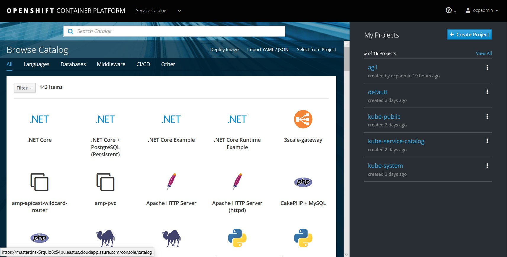
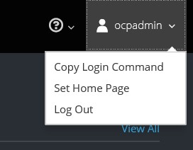

# Workshop: SQL Server on OpenShift

#### <i>A Microsoft workshop from the SQL Server team</i>

 <h2>Prerequisites</h2>

You'll cover the following topics in this Module:

<dl>

  <dt><a href="#3-0">0.0 Prerequisites</a></dt>
  
</dl>

<h2><a name="3-0">0.0 Prerequisites</a></h2>

In this module you will learn what the Prerequisites are for this workshop.

The workshop does not assume a deep working knowledge of SQL Server or OpenShift. It does have an assumption to know basics of using a Linux bash shell but all commands are provided to run the activities including scripts.

In order to go through the activities of this workshop you will need the following:

**Note**: It is possible your instructor will provide you with a client environment and full access to an OpenShift cluster including login credentials.

- Access to an OpenShift 3.11 cluster. The workshop is currently designed for OpenShift 3.11 and has not been tested for OpenShift 4.0
- Modules 1 through 4 require user privileges for the OpenShift cluster at **anyuid** at minimum. Module 5 currently requires cluster admin rights.
- A client computer that has access to connect to the OpenShift cluster and has the following software installed

1. A Linux bash shell
2. The OpenShift CLI (oc.exe)
3. Azure Data Studio - Minimum version is 1.5.2
4. SQL Command Line Tools (sqlcmd)
5. git client (only needed if you do not have the latest version of the workshop provided to you by the instructor)
6. In addition, the client computer must be able to connect to the Internet to download a sample file or your instructor must provide it for you (WideWorldImporters-Full.bak)

The workshop currently supports a single node OpenShift cluster. The single user node must have at least 8Gb of RAM available.

Proceed to the Activity to go through the prerequisites before going to Module 01.

<b><a name="aks">Activity: Prerequsites</a></b>

1. Download the latest version of the workshop from https://aka.ms/sqlworkshops. If you have used git clone to pull down the repo of the workshops, run **git pull** to get the latest version.

2. Login to your OpenShift cluster by using the URL provided to you for the **openshiftConsoleUrl** in a web browser

3. You may get warnings from the web page saying "This site is not secure". Click Details and then "Go on to the webpage"

4. You will be presented with a login screen like the following

    

5. Tyep in the user name and password provided to you for OpenShift cluster access. Your instructor may called this **openshiftAdminUsername** and **openshiftPassword**

6. You will now see a new web page like teh following

    

7. In the upper right hand corner, click on your user name and select Copy Login Command like the following

    

8. You now have on your clipboard a complete oc login sytnax with a token. Open up a shell and paste in the copy (right click your mouse)

    The command should look something like this

    `oc login https://[masterconsoleaddress]:443 --token=[tokenstring]`

    Hit enter

    You should see results like the following and then placed back at the command prompt

<pre>Logged into "https://[masterconsoleurl]:443" as "ocpadmin" using the token provided.

You have access to the following projects and can switch between them with 'oc project projectname':

  * default
    kube-public
    kube-service-catalog
    kube-system
    management-infra
    openshift
    openshift-ansible-service-broker
    openshift-console
    openshift-infra
    openshift-logging
    openshift-monitoring
    openshift-node
    openshift-sdn
    openshift-template-service-broker
    openshift-web-console

Using project "default".
</pre>

You have now successfully logged into the OpenShift Cluster and can proceed with Module 01.

<b>For Further Study</b>

- [RedHat OpenShift](https://www.openshift.com/)
- [oc CLI downloads](https://www.okd.io/download.html)
- [Azure Data Studio](https://docs.microsoft.com/en-us/sql/azure-data-studio/what-is)
- [SQL Command Line Tools for Linux](https://docs.microsoft.com/en-us/sql/linux/sql-server-linux-setup-tools)
- [SQL Command Line Tools for MacOS](https://docs.microsoft.com/en-us/sql/linux/sql-server-linux-setup-tools?view=sql-server-2017#macos)
- [SQL Command Line Tools for Windows](https://www.microsoft.com/en-us/download/details.aspx?id=53591)

<b >Next Steps</b>

Next, Continue to <a href="01_Deploy.md" target="_blank"><i>
Deploy SQL Server on OpenShift</i></a>.
