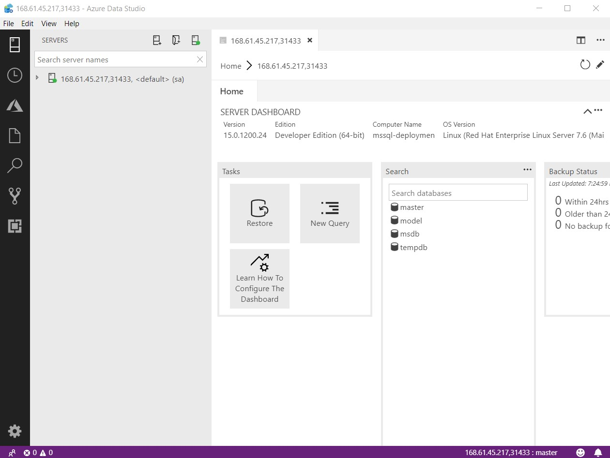
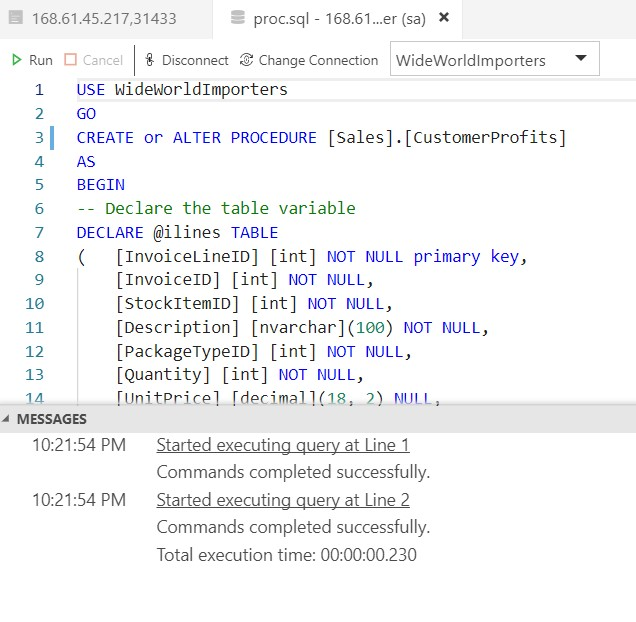
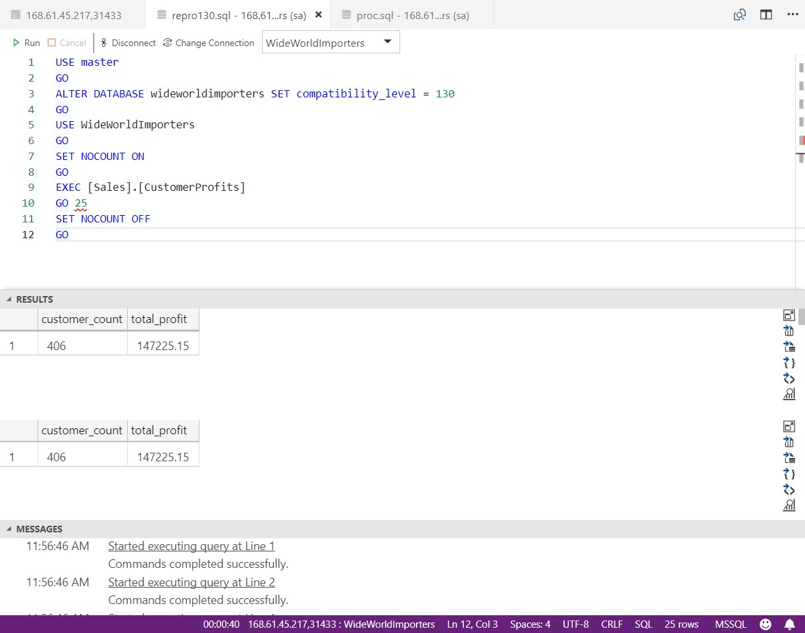
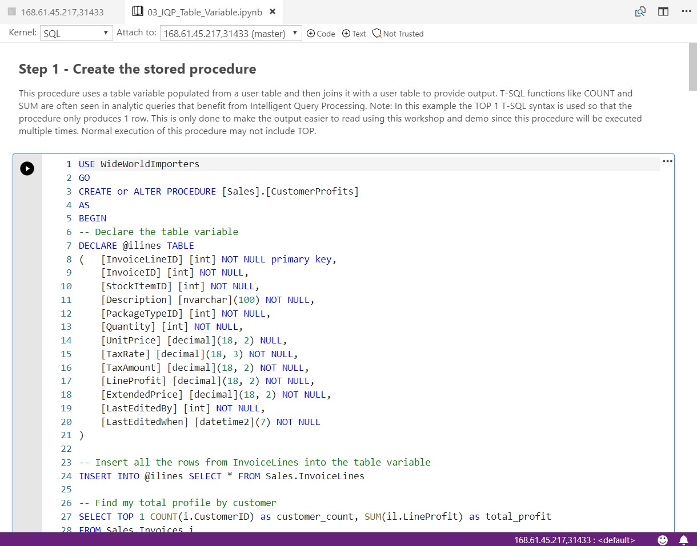

# Workshop: SQL Server 2019 on OpenShift

#### <i>A Microsoft workshop from the SQL Server team</i>

<p style="border-bottom: 1px solid lightgrey;"></p>

 <h2>SQL Server Performance</h2>

You'll cover the following topics in this Module:

<dl>

  <dt><a href="#3-0">3.0 SQL Server Intelligent Query Processing</a></dt>
  <dt><a href="#3-1">3.1 Using Query Store for performance analysis</a></dt>
  
</dl>

<p style="border-bottom: 1px solid lightgrey;"></p>

<h2><a name="3-0">3.0 SQL Server Intelligent Query Processing</a></h2>

In this module you will learn about the Intelligent Query processing capabilities new to SQL Server 2019. You will use activities to learn these concepts against the SQL Server container you have deployed in OpenShift. This demonstrates the compatibility of the SQL Server engine across multiple platforms as this entire module could be used against SQL Server 2019 running on Windows, Linux, and containers.

Intelligent Query processing is a suite of features built into the query processor for SQL Server 2019 allowing developers and data professionals to accelerate database performance automatically without any application changes. T-SQL queries simply need to be run with a database compatibility level of 150 to take advantage of these enhancements.

You can read more about database compatibility at https://docs.microsoft.com/en-us/sql/t-sql/statements/alter-database-transact-sql-compatibility-level?view=sql-server-2017#compatibility-levels-and-sql-server-upgrades.

The following is a diagram showing the features of Intelligent Query Processing including capabilities from SQL Server 2017


You can read the documentation for a description and example of all of these features at https://docs.microsoft.com/en-us/sql/relational-databases/performance/intelligent-query-processing.

**Note**: One of the features of Intelligent Query Processing, approximate count distinct, does not require database compatibility of 150.

Proceed to the Activity to learn an example of how Intelligent Query Processing can accelerate query performance automatically with no application changes.

<p style="border-bottom: 1px solid lightgrey;"></p>

<p><b><a name="aks">Activity: SQL Server Intelligent Query Processing</a></b></p>

Follow these steps to learn more about SQL Server Intelligent Query Processing. **Note**: this module assumes you have completed all the steps in Module 01 and 02.

In this activity, you will learn how to use the built-in capabilities of Intelligent Query Processing in SQL Server 2019 simply by changing the database compatibility of WideWorldImporters to version 150 with no application changes.

You have been provided a stored procedure called **CustomerProfits** which you will deploy in the **Facts** schema of the WideWorldImporters database. The stored procedure uses a concept called a table variable to store interim results from a user table and then use that table variable to join with other data in the WideWorldImporters database. In past releases of SQL Server, this design pattern can be a problem as SQL Server would always estimate the table variable only contains 1 row of data. This can cause issues with building the optimal query plan for fast performance. 

SQL Server 2019 Intelligent Query Processing includes a capability called *deferred table variable compilation* to improve the performance of stored procedures like these by ensuring the stored procedure is created in a database with a compatibility level of 150, which is the default for SQL Server 2019.

The WideWorldImporters database example was created with SQL Server 2016 which had a default database compatibility level of 130. When a database is restored from a previous version oF SQL Server, the compatibility level of the database is preserved to help reduce the risk of upgrades.

You will observe the performance of the CustomerProfits stored procedure with database compatibility level of 130 on SQL Server 2019. You will then compare the performance of the same procedure with no changes with a database compatibility of 150 which will enable the query processor to use deferred table variable compilation.

You will be running a series of commands and SQL Server T-SQL statements to observe performance.

1. To connect to the SQL Server deployed on OpenShift, run the following command to get the IP address and port of the LoadBalancer service associated with the SQL Server container.

    `oc get service mssql-service`

    You should see results like the following

   <pre>NAME            TYPE           CLUSTER-IP      EXTERNAL-IP     PORT(S)           AGE
   mssql-service   LoadBalancer   172.30.166.56   168.61.45.217   31433:30738/TCP   1h</pre>

   Take note of the EXTERNAL-IP and PORT (the number before the ":"). You will use these to connect to SQL Server throughout this module.

2. Launch the Azure Data Studio application. Look for the icon

    <p>

3. The first time you launch Azure Data Studio, you may see the following choices. For the purposes of this workshop, select No to not load the preview feature and use x to close out the 2nd choice to collect usage data
    
    <p>

4. You will now be presented with the following screen to enter in your connection details for SQL Server. For Server, put in the values for EXTERNAL IP, PORT from step 1 above. Change the Authentication type to SQL Login, Put in a User name of sa with the Password you used for the secret in Module 01 when you deployed SQL Server. I also recommend you click the checkbox for Remember Password so you will not have to do it again for future connections. Click the Connect button to connect. An example of a connection looks like the following

    <p>

5. A successful connection should look like the following

    

6. Open the script **proc.sql** by using the File Menu/Open File option of Azure Data Studio. The file can be found in the **sqlworkshops/SQLonOpenShift/sqlonopenshift/03_performance/iqp** folder

    The stored procedure looks like the following

   ```sql
   USE WideWorldImporters
   GO
   CREATE or ALTER PROCEDURE [Sales].[CustomerProfits]
   AS
   BEGIN
   -- Declare the table variable
   DECLARE @ilines TABLE
   ([InvoiceLineID] [int] NOT NULL primary key,
	    [InvoiceID] [int] NOT NULL,
	    [StockItemID] [int] NOT NULL,
	    [Description] [nvarchar](100) NOT NULL,
	    [PackageTypeID] [int] NOT NULL,
	    [Quantity] [int] NOT NULL,
	    [UnitPrice] [decimal](18, 2) NULL,
	    [TaxRate] [decimal](18, 3) NOT NULL,
	    [TaxAmount] [decimal](18, 2) NOT NULL,
	    [LineProfit] [decimal](18, 2) NOT NULL,
	    [ExtendedPrice] [decimal](18, 2) NOT NULL,
	    [LastEditedBy] [int] NOT NULL,
	    [LastEditedWhen] [datetime2](7) NOT NULL
   )
    
   -- Insert all the rows from InvoiceLines into the table variable
   INSERT INTO @ilines SELECT * FROM Sales.InvoiceLines
   -- Find my total profile by customer
   SELECT TOP 1 COUNT(i.CustomerID) as customer_count, SUM(il.LineProfit) as total_profit
   FROM Sales.Invoices i
   INNER JOIN @ilines il
   ON i.InvoiceID = il.InvoiceID
   GROUP By i.CustomerID
   END
   GO
   ```

    This procedure uses a table variable populated from a user table and then joins it with a user table to provide output. T-SQL functions like COUNT and SUM are often seen in analytic queries that benefit from Intelligent Query Processing. **Note**: In this example the TOP 1 T-SQL syntax is used so that the procedure only produces 1 row. This is only done to make the output easier to read using this workshop and demo since this procedure will be executed multiple times. Normal execution of this procedure may not include TOP.

    Click the Run button to execute the script. You will be prompted to pick the connection to execute the script. Select the connection you created in Step 4.

    When you execute this script the results should look like the following

    

7. You have been told this procedure executes fairly quickly with a single execution in a few seconds but over several iterations, the total duration is over 20 seconds, which is not acceptable to the application.

    Open the script **repro130.sql** by using the File Menu/Open File option of Azure Data Studio. The file can be found in the **sqlworkshops/SQLonOpenShift/sqlonopenshift/03_performance/iqp** folder.

    The script looks like the following

   ```sql
   USE master
   GO
   ALTER DATABASE wideworldimporters SET compatibility_level = 130
   GO
   USE WideWorldImporters
   GO
   SET NOCOUNT ON
   GO
   EXEC [Sales].[CustomerProfits]
   GO 25
   SET NOCOUNT OFF
   GO
   ```
    The script will ensure the database is in a compatibility mode that is less than 150 so Intelligent Query Processing will NOT be enabled. The script also turns off rowcount messages to be returned to the client to reduce network traffic for this test. Then the script executes the stored procedure. Notice the syntax of **GO 25**. This is a client tool tip that says to run the batch 25 times (avoids having to construct a loop)

    Click the Run button to execute the script to observe the results. Choose the connection by clicking on the IP,PORT you created for the SQL Server container and click Connect.

    You will see while the query is executing in the bottom status bar the current elapsed execution time, the server connection details, a status of **Executing Query**, and number of rows being returned to the client.

    

    The query should complete in well over 30 seconds. Given result sets are being sent back to the client, it can take even longer depending on connectivity speeds of your client workstation.

    The final results of Azure Data Studio should look like this

    

    You can scroll in the RESULTS or MESSAGES pane. If you scroll down to the bottom of the MESSAGES pane, you can see the total execution time (this includes time to execute the stored procedure 25 times on the server but also return results to the client). Your results should look something like this (30 seconds or greater)

    

8. Now let's run the same exact test but with database compatibility of 150. You will not make any changes to the stored procedure.

    Open the script **repro150.sql** by using the File Menu/Open File option of Azure Data Studio. The file can be found in the **sqlworkshops/SQLonOpenShift/sqlonopenshift/03_performance/iqp** folder.

    Use the SQL container connection as you have done in previous steps. The script should look like this


   ```sql
   USE master
   GO
   ALTER DATABASE wideworldimporters SET compatibility_level = 150
   GO
   USE WideWorldImporters
   GO
   SET NOCOUNT ON
   GO
   EXEC [Sales].[CustomerProfits]
   GO 25
   SET NOCOUNT OFF
   GO
   ```
    Notice this is the same script except database compatibility of 150 is used. This time, the query processor in SQL Server will enable table variable deferred compilation so a better query plan can be chosen

9. Run the script and choose the SQL Server container connection. Go through the same steps as in Step 8 to analyze the results. The script should execute far faster than before. Your speeds can vary but should be 15 seconds or less.

As a **post workshop exercise** you can go through this activity in a SQL notebook. For SQL notebooks,use the File menu of Azure Data Studio (Open File option) to open the **03_IQP_Table_Variable.ipynb** notebook in the **sqlworkshops/SQLOnOpenShift/sqlonopenshift/iqp/03_performance** folder. Follow the steps provided in the notebook to complete the activity.

The SQL notebook experience looks like the following:



Read each step in the notebook and use the Play button to execute each T-SQL script. Use the scrollbar to scroll through the notebook. 

The rest of the steps in this section of the Module is for the experience without using a notebook. Proceed to section 3.1.

<p style="border-bottom: 1px solid lightgrey;"></p>

<h2><a name="3-1">3.1 Using Query Store for Performance Analysis</a></h2>

In this module you will learn how to use the Query Store, a built-in performance analysis feature of SQL Server, to analyze the performance differences of the queries run in Section 3.0 of this Module.

The Query Store is built into the query processing engine, enabled using an option for each database in SQL Server. Once enabled, performance statistics for queries are cached and stored in the SQL user database so they are persisted across server restarts.

In addition, the Query Store comes with a series of catalog and dynamic management views to gain insight into recorded query performance.

You can read more about the Query Store at https://docs.microsoft.com/en-us/sql/relational-databases/performance/monitoring-performance-by-using-the-query-store.

<p style="border-bottom: 1px solid lightgrey;"></p>

<p><b><a name="aks">Activity: Using Query Store for Performance Analysis</a></b></p>

The WideWorldImporters sample database that you restored in Module 02 has the Query Store enabled. Therefore, if you performed the activity in Section 3.0 of this module, the Query Store was recording performance information about each query execution.

Go through the following steps to use the Query Store to examine the query performance differences for the CustomerProfits stored procedure when executed with database compatibility 130 vs 150.

Open the script **querystore.sql** by using the File Menu/Open File option of Azure Data Studio. The file can be found in the **sqlworkshops/SQLonOpenShift/sqlonopenshift/03_performance/iqp** folder.

Use the SQL container connection as you have done in previous steps. The T-SQL statement to use the Query Store for this activity looks like the following


```sql
USE WideWorldImporters
GO
SELECT qsp.query_id, qsp.plan_id, qsp.compatibility_level, AVG(qsrs.avg_duration)/1000 as avg_duration_ms, AVG(qsrs.avg_logical_io_reads) as avg_logical_io,CAST (qsp.query_plan as XML),qsqt.query_sql_text
FROM sys.query_store_plan qsp
INNER JOIN sys.query_store_runtime_stats qsrs
ON qsp.plan_id = qsrs.plan_id
INNER JOIN sys.query_store_runtime_stats_interval qsrsi
ON qsrs.runtime_stats_interval_id = qsrsi.runtime_stats_interval_id
AND qsrsi.start_time between DATEADD(HOUR, -1, GETDATE()) and GETDATE()
INNER JOIN sys.query_store_query qsq
ON qsp.query_id = qsq. query_id
INNER JOIN sys.query_store_query_text qsqt
ON qsq.query_text_id = qsqt.query_text_id
AND query_sql_text LIKE '%Invoices%'
GROUP BY qsp.query_id, qsp.plan_id, qsrs.avg_duration, qsp.compatibility_level, qsp.query_plan, query_sql_text, qsrs.last_execution_time
ORDER BY qsrs.last_execution_time DESC, query_id DESC, qsp.plan_id DESC
GO
```
 To even the seasoned SQL user this query looks daunting. This activity is not intended for you to understand every details of how the query works but as an example of how to use the Query Store Dynamic Management Views (DMV) to analyze the performance differences for the stored procedure you used in Section 3.0.

 The query is designed to focus on the most recent execution of the query in the stored procedure CustomerProfits that has run faster with Intelligent Query Processing.

 The results of the query should look something like the following (the values query_id and plan_id will likely be different)

 

 The query_id uniquely identifies the SELECT TOP.. statement. The plan_id shows that two different query plans were used for the same query. One with database compatibility of 130 and one with 150.
    
 Notice the avg_duration_ms is much higher for the row using the plan for compatibility_level = 130. The reason? Look at the avg_logical_io which is the number of database pages read needed for the query. The number is much higher for the longer running query, typically due to an inefficient query plan.

 So these results show the *same* query but two different query plans, one faster on average and more efficient than the other. The plan for compatibility_level = 150 was using table variable deferred compilation. The last columns shows the T-SQL query text within the stored procedure.

 One of the columns on the right is the estimated query plan in XML. Reading the details of this XML is beyond the scope of this workshop but contains the details of how the query plan was built using table variable deferred compilation. In addition, in these XML details is the use of an Adaptive Join, which is another capability of Intelligent Query Processing.

 If you saved the XML output as a .sqlplan file and opened up the file in SQL Server Management Studio (SSMS), you would see the following graphical plan for the query using compatibility level = 130

 

 In this plan, the query processor chooses to use the table variable as the outer table of a Nested Loops Join which means it iterates through each row in the outer table to join to the inner table. Since the query processor estimates one row for the table variable, this is reasonable. But in reality, there are over 200,000 rows in the table variable so this ends up with many unnecessary logical reads (hence the high number of logical IO from query store)

 The following output is an example for the stored procedure execution with compatibiilty level of 150

 

 In this example SQL has recognized the table variable has more than 1 row and has chosen a different join method called a hash join. Furthermore, it has injected into the plan the concept of an **Adaptive Join** so that if there is small enough rowset in the table variable it could dynamically and automatically choose a Nested Loops Join. What is not seen from this diagram (which you can see from the properties detail in the XML plan) that is the query processor is using a third concept called **batch mode processing on rowstore** (rowstore is normal table as opposed to a columnstore).

As a **post workshop exercise** you can go through this activity in a SQL notebook. Uuse the File menu of Azure Data Studio (Open File option) to open the **03_Query_Store.ipynb** notebook in the **sqlworkshops/SQLOnOpenShift/sqlonopenshift/iqp/03_performance** folder. Follow the steps provided in the notebook to complete the activity.

In this activity you have seen how to use the Query Store for performance insights including the ability to see differences for the same query text of different query plans, including those that benefit from Intelligent Query Processing.

You can now proceed to Next Steps to learn about High Availability for SQL Server on OpenShift.

<p style="border-bottom: 1px solid lightgrey;"></p>

<p><b>For Further Study</b></p>

- [Intelligent Query Processing in SQL Server](https://docs.microsoft.com/en-us/sql/relational-databases/performance/intelligent-query-processing)
- [Q&A about Intelligent Query Processing](https://techcommunity.microsoft.com/t5/Azure-SQL-Database/Intelligent-Query-Processing-Q-amp-A/ba-p/446657)
- [Monitoring performance of SQL Server using the Query Store](https://docs.microsoft.com/en-us/sql/relational-databases/performance/monitoring-performance-by-using-the-query-store)
- [What is Azure Data Studio?](https://docs.microsoft.com/en-us/sql/azure-data-studio/what-is)
- [How to use Notebooks in Azure Data Studio](https://docs.microsoft.com/en-us/sql/azure-data-studio/sql-notebooks)

<p style="border-bottom: 1px solid lightgrey;"></p>

<p><b >Next Steps</b></p>

Next, Continue to <a href="04_HA.md" target="_blank"><i>SQL Server High Availabilty on OpenShift</i></a>.
